<div align="center">


<br>


</div>

# QuizTime

## Table of Contents
- [Overview](#overview)
- [Features](#features)
- [Project Structure](#project-structure)
- [Files Tree](#files-tree)
- [Getting Started](#getting-started)
  - [Prerequisites](#prerequisites)
  - [Installation](#installation)
  - [Using](#using)
- [Contributing](#contributing)
- [License](#license)

## Overview
QuizTime is a comprehensive interactive quiz application designed for both instructors and students. It provides a platform platform that enables instructors to create, manage, and evaluate online assessments for their courses. Simultaneously, it aims to provide a straightforward and convenient interface for quiz-takers by reminding them of upcoming tests and offering an easy-to-use interface for participating in quizzes. Additionally, QuizTime incorporates a deep learning-based proctoring system to prevent cheating and ensure fair evaluations during quizzes.

## Features
- **Authentication System:** QuizTime offers a secure two factor authentication system where users can log in using either their phone number or email address and need to go through face verification to access the platform.

- **Dashboard:** QuizTime provides separate dashboards for students and teachers, each offering role-specific features and functionalities.

- **Quiz Creation:** Instructors can create multiple-choice quizzes, set the start time, end time, topic, and specify which student groups should participate in each quiz.

- **Quiz Participation:** Students can participate in quizzes, answering questions and submitting their responses.

- **Proctoring System:** QuizTime employs deep learning techniques for proctoring, which includes:
  - **Mobile Phone Detection:** Identifies if students are using mobile phones during the quiz.
  - **Multiple Person Detection:** Ensures only the authorized student is taking the quiz.
  - **Window Switch Event Detection:** Monitors if students switch windows or tabs during the quiz.
  - **Audio Analysis:** Analyzes audio data for unusual behavior that may indicate cheating.

- **Scoring and Evaluation:** Automatically scores quizzes and provides results to instructors and students.

- **User-Friendly Interface:** Intuitive interface for both instructors and students, making it easy to navigate and use.

## Project Structure

### Files Tree
```
QuizTime/
├── static/
│   ├── assets/
│   ├── css/
│   ├── vendor/
│   └── ...
├── templates/
│   ├── includes/
│   │   ├── _formhelpers.html_
│   │   ├── _messages.html
│   │   └── ...
│   ├── admin_create_test.html
│   ├── admin_dashboard.html
│   ├── admin_display_questions.html
│   └── ...
├── app.py
├── Dockerfile
├── gunicorn.conf.py
├── LICENSE
├── README.md
├── requirements.txt
└── ...

```

### Database Design

QuizTime uses an efficient database design to store essential information:

- **class_master:** Contains details about the program, branch, and semester of a student.
- **questions:** Stores questions in different tests, including options and correct answers.
- **studentans:** Records answers submitted by students for each question.
- **testinfo:** Contains information about tests, including subject, topic, duration, start time, and end time.
- **teststatus:** Records whether a student has completed a test.
- **users:** A master table with information about all platform users.
- **proctoring_log:** Logs student activities during assessments.
- **window_estimation_log:** Logs window switch events performed by students during assessments.

## Interface

### Registration

- Users provide email, phone number, password, and a facial picture for identity validation during login.

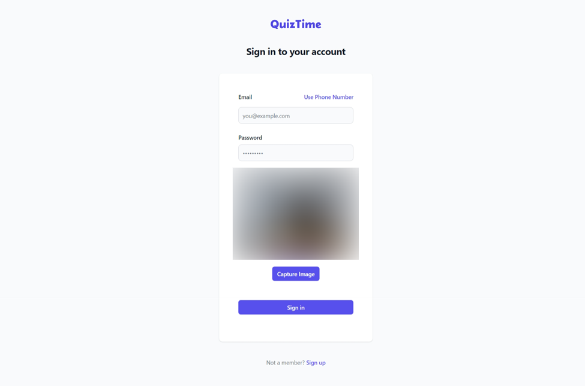

#### Login

- Users log in using their email/phone number, password, and facial identity verification.


### Student Interface

#### Dashboard

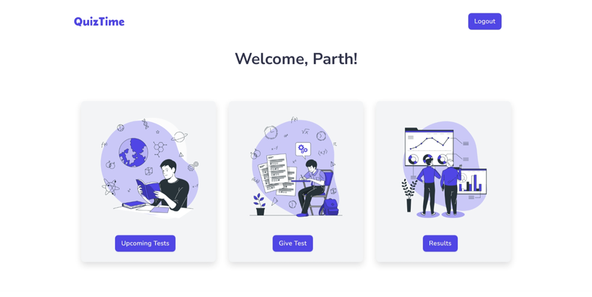

#### Test

- Students can select ongoing tests, validate their facial identity, and start the test.

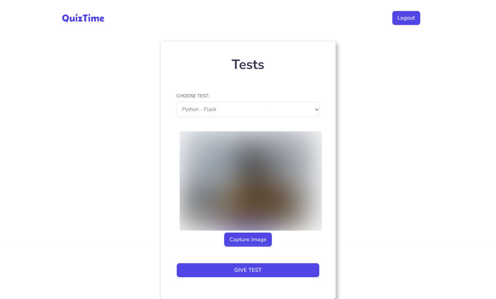

#### Test Results

- Students can view their test results.

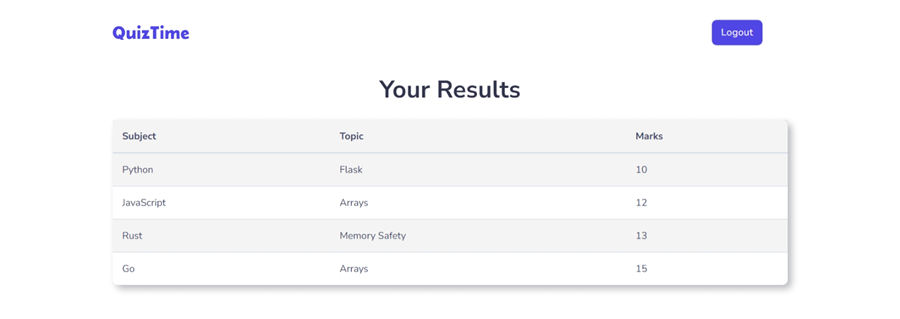

### Instructor Interface

#### Dashboard

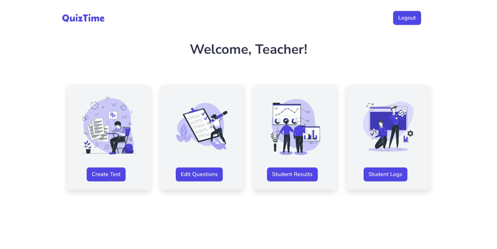

#### Create Test

- Instructors can create tests, specifying subject, topic, duration, start time, end time, and the student group allowed to take the test.

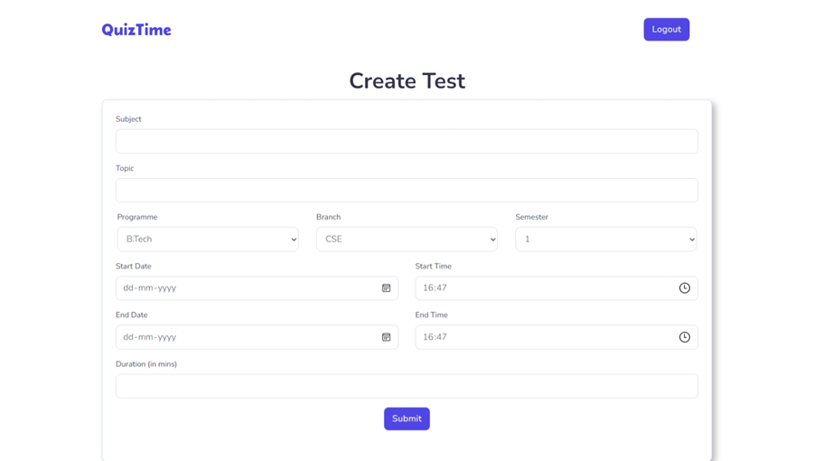

#### Student Results

- Instructors can view test performance for all students.

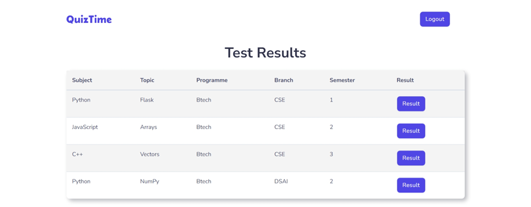

#### Student Proctoring Logs

- Instructors can view test logs for all students.

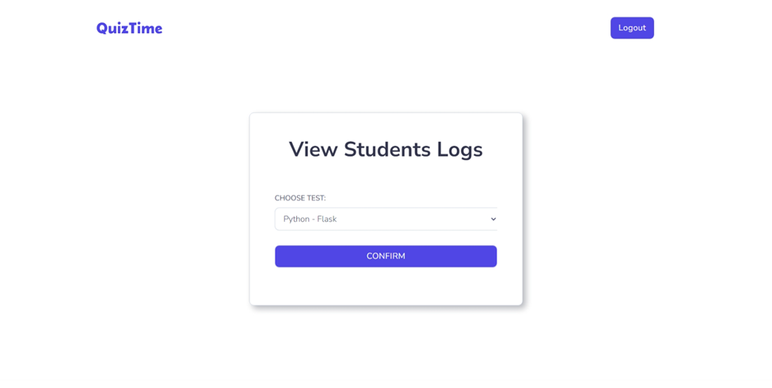
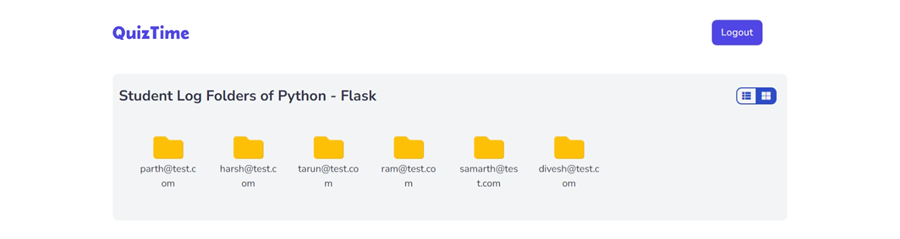
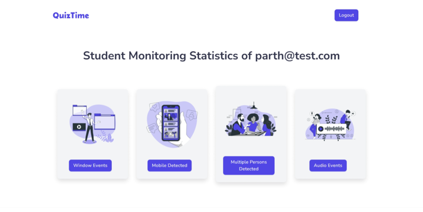

#### Window Event Logs

- Displays window switch events triggered by students during the test.

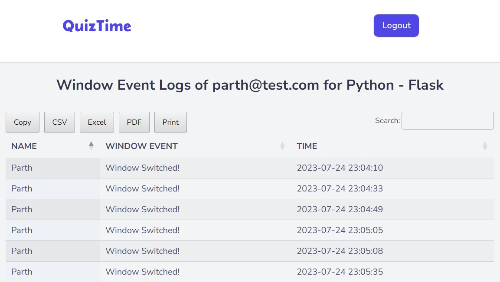

#### Mobile Detection Logs

- Provides information about the number of times a mobile device was detected during the test, along with the probability of it being a mobile.

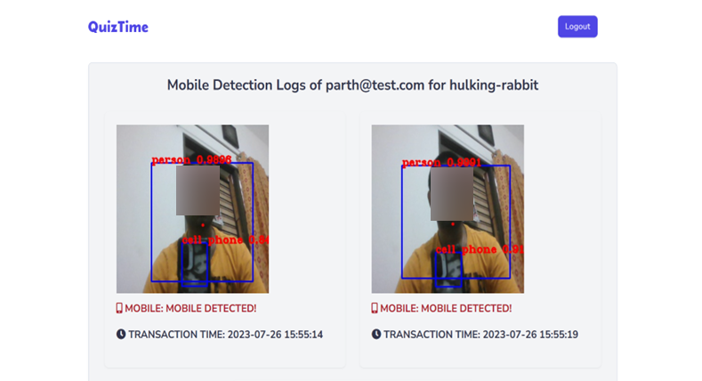

#### Audio Events Log

- Shows periodic audio samples taken during the test, along with the probability of the message being Normal, Low Disturbance, or Disturbance.

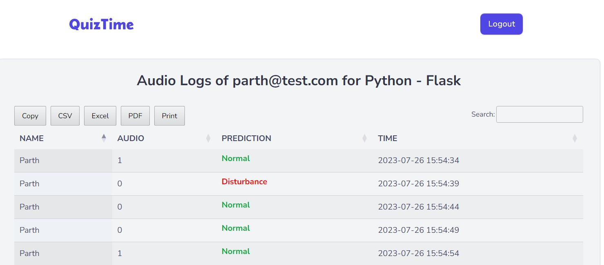

## Getting Started
To get started with QuizTime, follow these steps:

### Prerequisites
- Python 3.11
- Flask
- MySQL

### Installation
1. Clone the QuizTime repository from GitHub:
   ```bash
   git clone https://github.com/hbarsaiyan/QuizTime.git
   ```

2. Navigate to the project directory:
   ```bash
   cd QuizTime
   ```

3. Install the required dependencies:
   ```bash
   pip install -r requirements.txt
   ```

### Using
1. Create a `.env` file and add the values to environment varaibles from `.env_template`. 

2. Start the QuizTime application:

Windows:
   ```bash
   $env:FLASK_DEBUG=1
   $env:FLASK_APP="app.py"
   flask run
   ```

Linux:
   ```bash
   export FLASK_DEBUG=1
   export FLASK_APP="app.py"
   flask run
   ```

3. Open your web browser and access QuizTime at `http://localhost:5000`.

4. Sign up or log in to start creating or participating in quizzes.


## Contributing
I welcome contributions to QuizTime! If you have any ideas for improvements, new features, or bug fixes, feel free to open an issue or submit a pull request. 

## License
QuizTime is licensed under the [AGPL3 License](LICENSE). You are free to use, modify, and distribute this software as per the terms of the license.